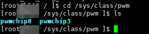

1、pwm驱动加载成功以后，会在/sys/class/pwm文件夹下生成pwmchipn，其中n是从零开始，例如，假设一个pwm控制器有两个pwm模块，每个模块有三路输出，那么，第一个pwm模块在/sys/class/pwm下的名称是pwmchip0，第二个模块的名称是pwmchip3，如下图所示：  
  
2、通过`open`函数打开pwmchipn下的export。此操作等同于在shell中`echo n > /sys/class/pwm/pwmchip0`，其中n是pwm模块的第n路输出。将pwm模块的第n路输出导出到文件系统中。  
3、通过`access`函数检查是否存在上面export出的pwmn通道。  
4、通过`open`函数打开`period、duty_cycle、enable`等参数。  
5、通过`write`函数向其中输入周期占空比和使能。  
6、access函数的使用
+ 头文件：unistd.h
+ 功能：确定文件或文件夹的访问权限。即，检查某个文件的存取方式，比如说是只读方式、只写方式等。如果指定的存取方式有效，则函数返回0，否则函数返回-1。
+ 用法：`int access(const char *filenpath, int mode);`
+ mode：
```c
#define R_OK 4 /* 判断是否有读权限. */
#define W_OK 2 /* 判断是否有读权限. */
#define X_OK 1 /* 判断是否有执行权限. */
#define F_OK 0 /* 判断是否存在. */
```

